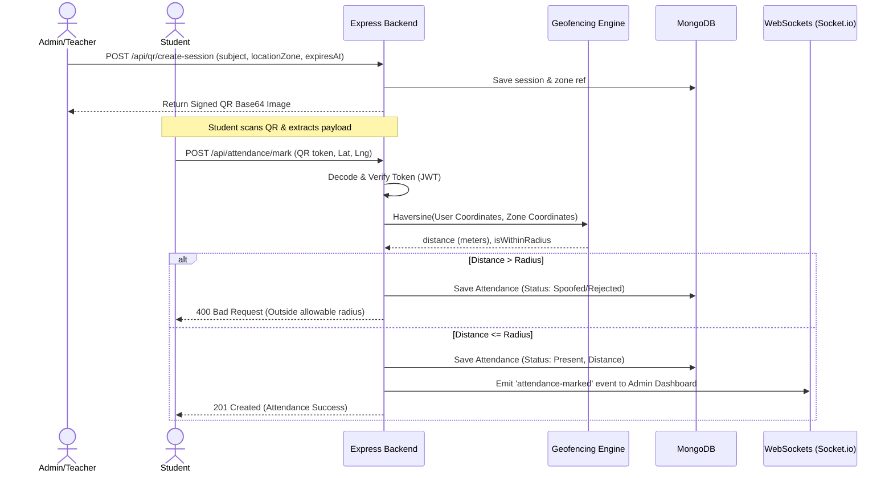

# Smart Attendance System with QR & GPS Verification 

**📺 [Watch the Live Demo Video Here](https://drive.google.com/file/d/1Bf0WL0WlRRqcm5ClA7LWM-P7wr03PCya/view?usp=drive_link)**

[](https://nodejs.org/)
[](https://expressjs.com/)
[](https://www.mongodb.com/)
[](https://socket.io/)
[](#)
[](LICENSE)

An industry-grade, production-ready, backend-driven attendance management platform that prevents proxy attendance using secure **QR Code Authentication** and **GPS Geolocation Verification**. Designed to follow clean layered architecture, SOLID principles, and professional security frameworks.

---

##  System Architecture & Workflow



---

##  Technology Stack

* **Core Backend Framework**: Node.js & Express.js
* **Real-time Engine**: Socket.io
* **Database & ODM**: MongoDB & Mongoose
* **Geofencing**: Math-based Haversine Formula (GPS Verification)
* **Security & Auth**: JWT (JSON Web Tokens) & `bcryptjs`
* **QR Generation Engine**: `qrcode` base64 builder
* **Input Sanitization & Validation**: `express-validator`
* **Performance & Safety**: Helmet, CORS, and Express Rate Limiter
* **Audit & HTTP Logging**: Winston & Morgan logger

---

##  Project Structure

```text
src/
├── config/             # DB & Winston Logger configurations
├── constants/          # Application-wide roles & status states
├── controllers/        # Express Controllers (handles request parsing & API output)
├── database/           # Mongoose setup (mounted schemas)
├── docs/               # API collections (Postman/Swagger details)
├── middlewares/        # Authentication, Role RBAC, Validations & Global Error Handlers
├── models/             # Mongoose schemas (User, Attendance, QRSession)
├── repositories/       # Abstraction layer directly querying database models
├── routes/             # Express API routing tables
├── services/           # Core business logic layer
├── utils/              # Helper utilities (AppError classes)
├── validators/         # Input rules defined using express-validator
├── app.js              # Express app configs and routing tables
└── server.js           # Server runner and database connectivity
```

---

##  Environment Variables Configuration

Create a `.env` file in the root directory:

```env
# Server Configurations
PORT=5000
NODE_ENV=development

# Database Configurations
MONGODB_URI=mongodb://localhost:27017/smart-attendance

# JWT Authentication Secrets
JWT_SECRET=super_secret_jwt_sign_key_123456_change_in_production
JWT_EXPIRES_IN=1h

# QR Session Secret
QR_SECRET=qr_data_encryption_secret_phrase
```

---

##  Installation & Setup Guide

### 1. Prerequisites
* Install [Node.js](https://nodejs.org/) (v18+)
* Install and run [MongoDB](https://www.mongodb.com/) locally or setup a MongoDB Atlas cloud database.

### 2. Clone and Install Dependencies
```bash
git clone https://github.com/your-username/Smart-Attendance-System-with-QR-GPS-Verification.git
cd Smart-Attendance-System-with-QR-GPS-Verification
npm install
```

### 3. Run the Development Server
```bash
npm run dev
```
The server will boot up at `http://localhost:5000`. You can check server health at `http://localhost:5000/health`.

### 4. Running the Test Suite
The project uses Jest and Supertest with mock databases to run assertions without database dependencies:
```bash
npm run test
```

---

##  Database Schema Definitions

### 1. Users Schema
* `fullName` (String, required)
* `email` (String, required, unique, lowercased, indexed)
* `password` (String, required, hidden by default)
* `role` (String, Admin | Teacher | Student | Employee)
* `department` (String, required)
* `course` (String, required if Student)
* `semester` (Number, required if Student)
* `studentId` (String, unique, indexed, required if Student)
* `employeeId` (String, unique, indexed, required if staff)
* `isActive` (Boolean, default: true)
* Timestamps: `createdAt`, `updatedAt`

### 2. QRSession Schema
* `sessionName` (String, required)
* `subject` (String, required)
* `createdBy` (ObjectId, ref: User, required)
* `qrToken` (String, unique, indexed)
* `expiresAt` (Date, indexed)
* `isActive` (Boolean, default: true)
* Timestamps: `createdAt`, `updatedAt`

### 3. Attendance Schema
* `userId` (ObjectId, ref: User, required)
* `qrSessionId` (ObjectId, ref: QRSession, required)
* `attendanceStatus` (String: Present | Absent | Late | Excused, default: Present)
* `attendanceTime` (Date, default: Date.now)
* `date` (Date, indexed, hours zeroed-out)
* Unique index on compound key: `{ userId, qrSessionId }` (prevents double attendance)

---

##  REST API Endpoints Map

### Authentication APIs
* `POST /api/auth/register` - Create user account (returns token)
* `POST /api/auth/login` - Validate credentials (returns token + sets httpOnly cookie)
* `POST /api/auth/logout` - Clear cookies/tokens
* `GET /api/auth/profile` - Fetch current user profile (JWT protected)
* `PUT /api/auth/profile` - Update user profile attributes (JWT protected)

### QR Session APIs
* `POST /api/qr/create-session` - Start a QR Session (Teacher/Admin only)
* `GET /api/qr/active` - List active sessions (All users)
* `GET /api/qr/:id` - Fetch details of a session (All users)
* `DELETE /api/qr/:id` - Deactivate/Terminate session (Creator/Admin only)

### Attendance APIs
* `POST /api/attendance/mark` - Mark scanning presence (Validates QR JWT + GPS Coordinates)
* `GET /api/attendance/history` - Fetch student's own attendance history
* `GET /api/attendance/all` - List all marked logs
* `GET /api/attendance/:id` - Get specific log details
* `PUT /api/attendance/:id` - Manual override status
* `DELETE /api/attendance/:id` - Delete log record

### Advanced APIs (Phase 2 Features)
* **Zones**: `POST /api/zones` - Create Location Zones for GPS fences
* **Zones**: `GET /api/zones` - List available active zones
* **Dashboard**: `GET /api/dashboard/stats` - Analytics, Real-time counts, 30-day percentage
* **Dashboard**: `GET /api/dashboard/trends` - Daily attendance graph logic
* **Reports**: `GET /api/reports/daily` - Extract structured daily attendance list
* **Reports**: `GET /api/reports/student/:studentId` - Comprehensive tracking report for an individual

---

##  Postman & Swagger Details
Import the prebuilt [Postman Collection](src/docs/postman_collection.json) to quickly interact with the endpoints. It contains templates for request payloads, variables, and automated tests.

---

##  Future Enhancements (Phase 3 & Beyond)
1. **Face Recognition integration**: Secondary biometric confirmation.
2. **Cloud/AWS Storage**: Offloading PDF/CSV exports directly to S3.
3. **Machine Learning Predictor**: Analyzing absentee trends.

---

##  License
This project is licensed under the MIT License - see the LICENSE file for details.