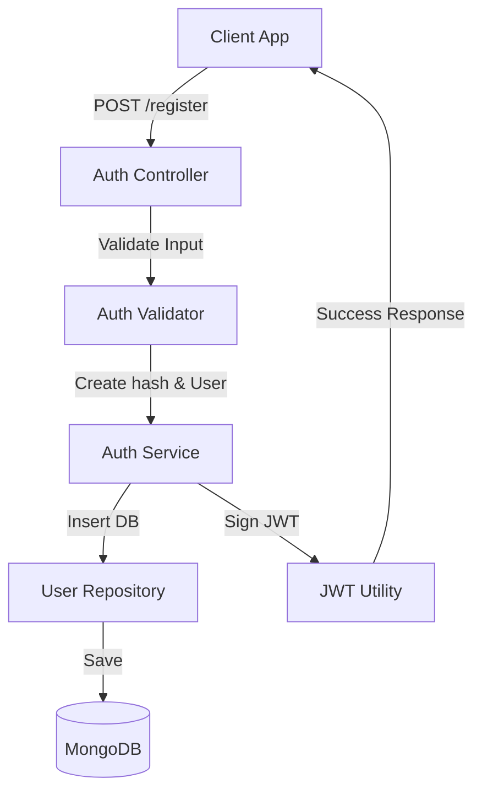
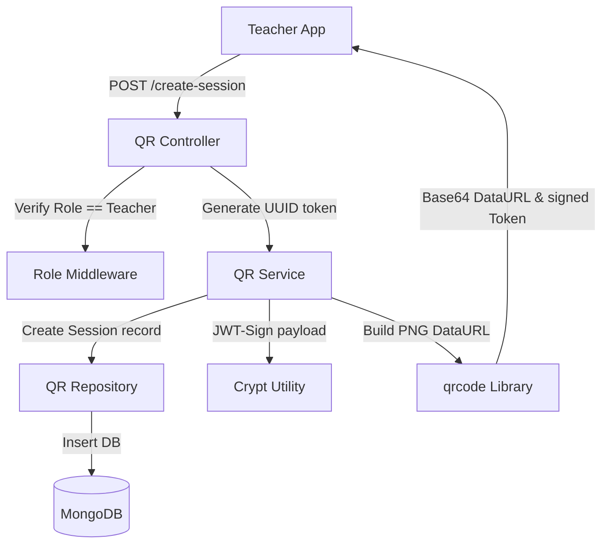
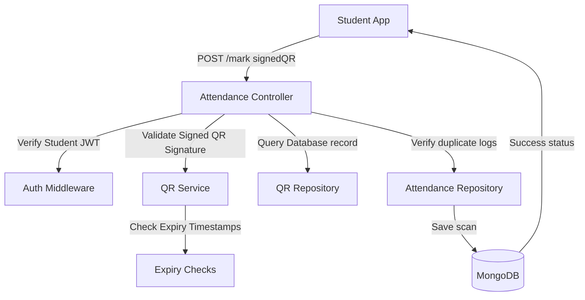

# Smart Attendance System with QR & GPS Verification - Phase 1 Documentation

## 1. Project Overview
The Smart Attendance System is designed to mitigate proxy attendance in universities and offices. In conventional environments, students/employees often mark attendance for absent peers. This application addresses that gap by generating dynamic, encrypted QR codes that change or expire rapidly and validating scans through user role-checking, token expiry checks, and (in Phase 2) GPS radius geofencing.

---

## 2. Folder Structure
The workspace follows **Clean Layered Architecture** with strict Separation of Concerns:
* **config**: Centralized database connection strings and structured log engines.
* **constants**: Enums representing database roles and system statuses.
* **models**: Mongoose schemas defining structural data validation and database indexes.
* **repositories**: Isolated data-access layer that handles direct mongoose queries.
* **services**: Core business rules (token signing, expired validations, credentials, registration rules).
* **controllers**: Request parsing and outgoing HTTP response formatter.
* **routes**: Mapping HTTP verbs and URI endpoints to controllers via validator/authenticator pipelines.
* **middlewares**: Security rules (rate limiting, Helmet headers, CORS filters), session validations (JWT checks), RBAC role permissions, and global error formats.
* **utils**: Reusable components, customized exception classes.
* **validators**: Express validation rules confirming field limits and types.

---

## 3. Database Design

### Users Collection
Stores academic and enterprise user credentials. High-frequency queries (emails, studentId, employeeId) are indexed.
* `fullName` - Character length checked, sanitized string.
* `email` - Regex validated, unique lowercased index.
* `password` - Bcrypt hashed, excluded from queries unless explicitly selected.
* `role` - Role validation (Admin, Teacher, Student, Employee).
* `department` - Department association.
* `course` / `semester` - Academic tracking fields (required only if role is Student).
* `studentId` / `employeeId` - Unique ID numbers (sparse indexed, dynamically required).
* `isActive` - Boolean flag representing account status. Allows soft delete support.

### QRSession Collection
Logs dynamically created attendance session windows.
* `sessionName` - Describing lecture or corporate block.
* `subject` - Target course module.
* `createdBy` - Reference linking to User.
* `qrToken` - Crytographically signed string containing structural data. Unique key indexed.
* `expiresAt` - Automatic time-to-live (TTL) expiration boundary.
* `isActive` - Deactivation toggle.

### Attendance Collection
Maintains scan logs of marked records.
* `userId` - Reference pointing to scanning User.
* `qrSessionId` - Reference linking back to QRSession.
* `attendanceStatus` - Present, Absent, Late, Excused.
* `attendanceTime` - Exact timestamp of QR scanner execution.
* `date` - Hour-truncated calendar date for statistics compilation.
* **Compound unique index** on `{ userId, qrSessionId }` ensures students cannot scan a session QR code twice.

---

## 4. Workflows & Sequence Flows

### User Registration & Authentication

### QR Session Creation (Teacher)

### QR Scan & Presence Marking (Student)

---

## 5. Security Measures Implemented
1. **Helmet HTTP Headers**: Protects standard vulnerability disclosures (cross-site scripting, clickjacking, MIME sniffing).
2. **CORS Configuration**: Filters external HTTP requests to authorized clients.
3. **API Rate Limiting**: Restricts brute force registrations or logins by tracking IP footprints.
4. **Bcrypt Hashing**: Password storage relies on salt iteration hashing.
5. **Clean Global Error Handler**: Never logs internal DB exceptions or source paths to standard API consumers. Converts database unique violations or cast errors to readable status outputs.
6. **Input Validation schemas**: Assures emails, mongoId formats, and mandatory body fields are parsed prior to routing execution.
